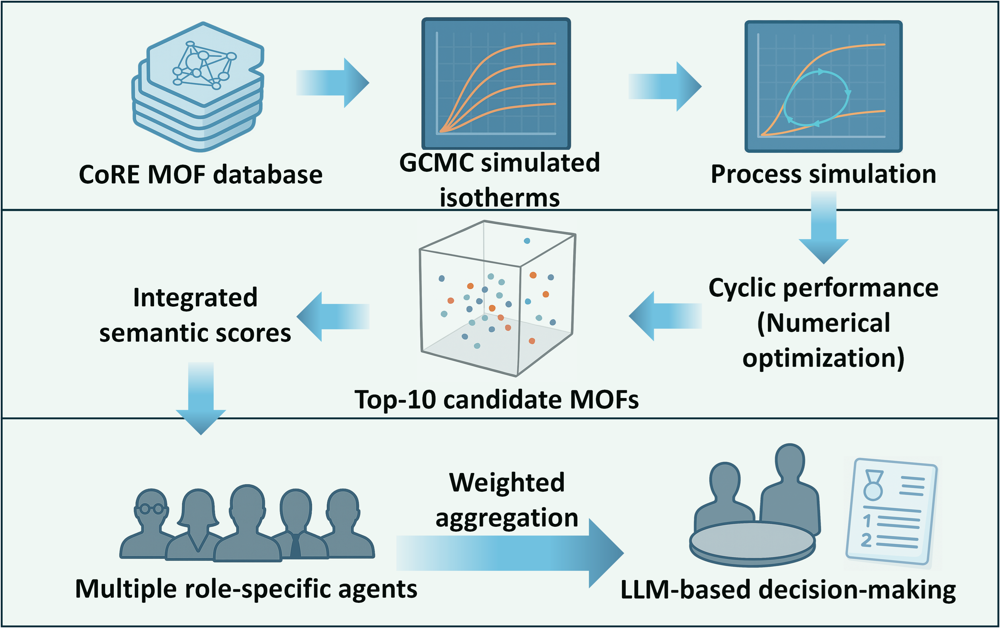

# A Large Language Model-Based Multi-Agent Methodology for Intelligent Materials Screening  
### A Case Study on MOFs for CO₂ Capture  

---

**Authors:**  
Yuanming Li<sup>a,1</sup>, Jie Zhao<sup>b,1</sup>, Xiangkun Elvis Cao<sup>c,d\*</sup>, Shuangjun Li<sup>e,\*</sup>  

**Affiliations:**  
a. School of Electrical Engineering, Korea University, Republic of Korea  
b. Department of Chemical and Biomolecular Engineering, National University of Singapore, Singapore  
c. Department of Mechanical and Biological Engineering, Imperial College London, UK  
d. Grantham Institute for Climate Change and the Environment, Imperial College London, UK  
e. Department of Chemical and Biological Engineering, Korea University, Republic of Korea  

<sup>1</sup> These authors contributed equally as first authors.  
* Contact author: (lym7499500@korea.ac.kr)

---


## 🚀 Project Overview
This repository accompanies the above study and packages a reusable workflow for intelligent MOF screening. It fuses deterministic multi-objective optimisation with a semantic large-language-model (LLM) consensus layer:

1. **Step A – Code-book construction:** align TSA simulation outputs with MOF descriptors.  
2. **Step B – Pareto pre-filtering:** prune dominated candidates in the \((p,r,e)\) objective space.  
3. **Step D – Evolutionary refinement:** explore trade-offs via NSGA-II / NSGA-III under multiple constraint regimes.  
4. **Step F – LLM multi-agent screening (optional):** role-specialised agents provide human-readable assessments on top of the numerical shortlist.

Precomputed datasets, candidate pools, and visualisations are included so that the workflow can be reproduced end-to-end.

## 📂 Repository Layout
```
MOFSelect/
├── agents/                         # Prompt templates for the LLM agents
├── data/                           # Sample CIF features, TSA outputs, code-book artefact
├── plots/                          # Example Pareto/evolutionary visualisations
├── results/                        # Representative CSV outputs for each optimisation regime
├── scripts/
│   ├── run_workflow.py             # Main CLI orchestrator (supersedes run_new.py)
│   ├── step_a_codebook_generation.py
│   ├── step_b_pareto_selection.py
│   ├── step_c_weighted_scoring.py
│   ├── step_d_evolutionary_search.py
│   ├── step_f_llm_agent_screening.py
│   └── run_agents.py               # Multi-agent orchestration entry point (Step F)
├── config.yaml                     # Example configuration
├── requirements.txt                # Python dependencies (Steps A–D and C)
└── README.md                       # This document
```
Running the workflow will refresh the contents of `data/codebook.parquet`, `results/`, `plots/`, and `reports/`.

## 🔧 Prerequisites
- Python 3.9+  
- Install base dependencies:
  ```bash
  pip install -r requirements.txt
  ```
  `scikit-learn` (needed for Step C) and `pymoo` (Step D) are included.

- **Optional (Step F – LLM stage)**  
  ```bash
  pip install autogen python-dotenv
  ```
  `autogen` powers the multi-agent framework; `python-dotenv` loads credentials from `.env`.

## 🔐 API Key Configuration (for Step F)
Step F uses the UNI API (OpenAI-compatible). Provide your key via environment variable or `.env`:
```bash
export UNI_API_KEY="sk-********"
# or create MOFSelect/.env with the same line
```
If no key is supplied, `run_agents.py` falls back to the placeholder `sk-your-api-key-here`. Real LLM calls will fail until a valid key is set. **Do not commit your actual key.**

## ⚙️ Usage
### Full pipeline (numerical + semantic)
```bash
python scripts/run_workflow.py --steps A,B,D,F
```

### Numerical pipeline only
```bash
python scripts/run_workflow.py --steps A,B,D
```

Useful flags:
- `--verbose` for detailed logging  
- `--timeout <seconds>` to cap runtime per step  
- `--continue-on-error` or `--yes` to bypass interactive prompts  
- `--config custom.yaml` to override data paths (see `config.yaml` for reference)

### Individual scripts
- Step A: `python scripts/step_a_codebook_generation.py`  
- Step B: `python scripts/step_b_pareto_selection.py`  
- Step C: `python scripts/step_c_weighted_scoring.py`  
- Step D: `python scripts/step_d_evolutionary_search.py`  
- Step F:  
  ```bash
  python scripts/step_f_llm_agent_screening.py \
      --k-screen 20 --n-final 5 \
      --input-file results/evolutionary_nsga2_single_weighted_selected.csv
  ```
  `--input-file` is optional; the script auto-detects the newest CSV in `results/` (evolutionary outputs first, otherwise the Pareto front).

### Multi-agent orchestration (direct)
```bash
python scripts/run_agents.py --input-file results/pareto_front.csv \
    --k-screen 20 --n-final 5
```

## 📊 Included Data & Outputs
- `data/cif_features/cif_features_preprocessed.csv` – curated MOF descriptors  
- `data/TSA_results/uff_ddec_all_results_20250801_182548.json` – TSA simulation results  
- `data/codebook.parquet` – aligned feature matrix produced by Step A  
- `results/` & `plots/` – representative outputs for reference/benchmarking

You can swap in your own datasets by editing `config.yaml` or passing `--config`.

## 🧪 Reproducing Paper Results
1. Run `python scripts/run_workflow.py --steps A,B,D` to regenerate numerical outputs.  
2. (Optional) Install `autogen python-dotenv`, set `UNI_API_KEY`, then run Step F via the workflow or `run_agents.py`.  
3. Inspect new CSV/visual files in `results/`, `plots/`, and `reports/optimization_llm_agent_workflow_report.txt`.

## ⚠️ Notes
- Example outputs ship with the repository; remove them if starting from scratch.  
- Step F will emit warnings and skip execution when the LLM dependencies or API key are missing—this is expected.  
- Keep `.env` (or any credential file) out of version control.

## 📄 Licence
This project is released under the MIT License.  
You are free to use, modify, and redistribute the code provided that you include the original copyright notice
and this permission notice in any copies or substantial portions of the software.  
For the complete text, see the accompanying `LICENSE` file or insert the standard MIT licence boilerplate in your distribution.
